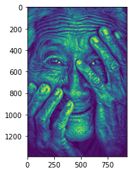
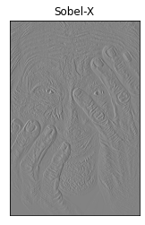
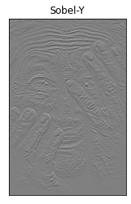
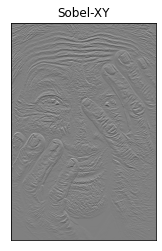
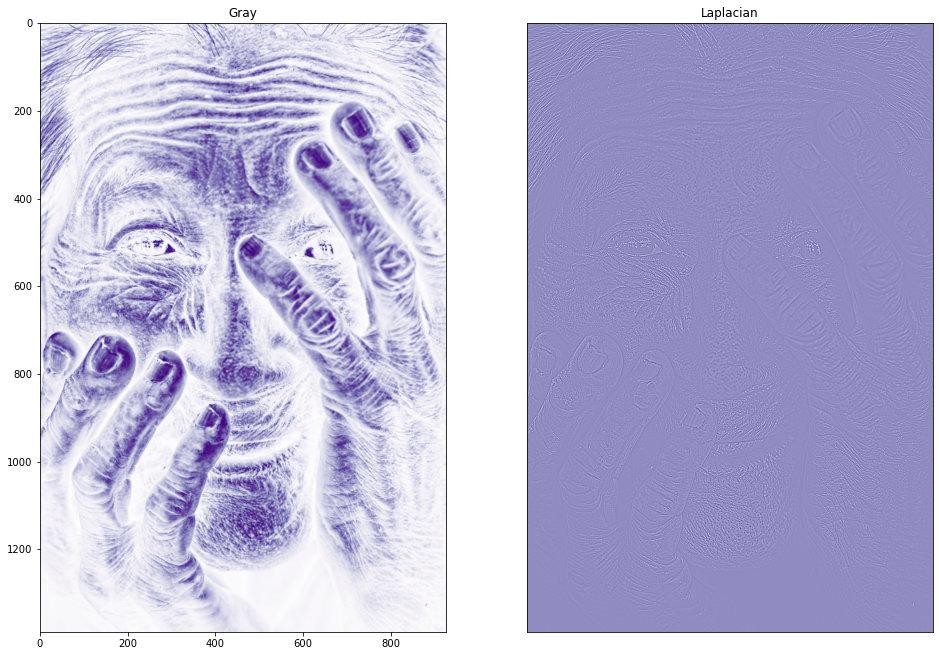
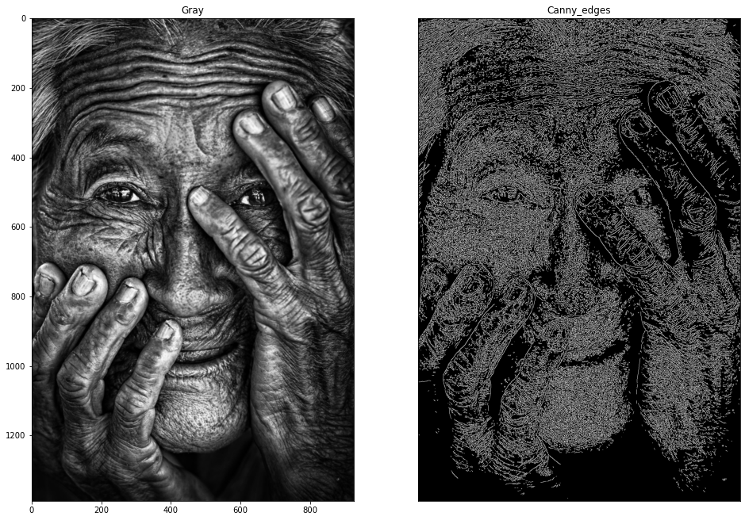

# Edge-Detection
## Aim:
To perform edge detection using Sobel, Laplacian, and Canny edge detectors.

## Software Required:
Anaconda - Python 3.7

## Algorithm:
### Step1:
Import all the necessary modules for the program.

### Step2:
Load a image using imread() from cv2 module.

### Step3:
Convert the image to grayscale.

### Step4:
Using Sobel operator from cv2,detect the edges of the image.

### Step5:
Using Laplacian operator from cv2,detect the edges of the image.

### Step6:
Using Canny operator from cv2,detect the edges of the image.
 
## Program:

``` Python
# Import the packages
import cv2
import numpy as np
import matplotlib.pyplot as plt
# Load the image, Convert to grayscale and remove noise
image1=cv2.imread('1.png',0)
plt.imshow(image1)

# SOBEL-X EDGE DETECTOR
import cv2
import matplotlib.pyplot as plt
image=cv2.imread("1.png")
gray_img=cv2.cvtColor(image,cv2.COLOR_BGR2GRAY)
img=cv2.GaussianBlur(gray_img,(3,3),0)
sobelx=cv2.Sobel(img,cv2.CV_64F,1,0,ksize=5)
plt.subplot(1,2,2)
plt.imshow(sobelx,cmap='gray')
plt.title("Sobel-X")
plt.xticks([])
plt.yticks([])
plt.show()

# SOBEL-Y EDGE DETECTOR
import cv2
import matplotlib.pyplot as plt
image=cv2.imread("1.png")
gray_img=cv2.cvtColor(image,cv2.COLOR_BGR2GRAY)
img=cv2.GaussianBlur(gray_img,(3,3),0)
sobely=cv2.Sobel(img,cv2.CV_64F,0,1,ksize=5)
plt.subplot(1,2,2)
plt.imshow(sobely,cmap='gray')
plt.title("Sobel-Y")
plt.xticks([])
plt.yticks([])
plt.show()

# SOBEL-XY EDGE DETECTOR
import cv2
import matplotlib.pyplot as plt
image=cv2.imread("1.png")
gray_img=cv2.cvtColor(image,cv2.COLOR_BGR2GRAY)
img=cv2.GaussianBlur(gray_img,(3,3),0)
sobelxy=cv2.Sobel(img,cv2.CV_64F,0,1,ksize=5)
plt.subplot(1,2,2)
plt.imshow(sobelxy,cmap='gray')
plt.title("Sobel-XY")
plt.xticks([])
plt.yticks([])
plt.show()

# LAPLACIAN EDGE DETECTOR
import cv2
import matplotlib.pyplot as plt
image=cv2.imread("1.PNG")
gray_img=cv2.cvtColor(image,cv2.COLOR_BGR2GRAY)
img=cv2.GaussianBlur(gray_img,(3,3),0)
laplacian = cv2.Laplacian(img,cv2.CV_64F)
plt.figure(figsize=(16,16))
plt.subplot(1,2,1)
plt.imshow(img,cmap='Purples')
plt.title('Gray')
plt.subplot(1,2,2)
plt.imshow(laplacian,cmap='Purples')
plt.title("Laplacian")
plt.xticks([])
plt.yticks([])
plt.show()

# CANNY EDGE DETECTOR
import cv2
import matplotlib.pyplot as plt
image=cv2.imread("1.png")
gray_img=cv2.cvtColor(image,cv2.COLOR_BGR2GRAY)
img=cv2.GaussianBlur(gray_img,(3,3),0)
canny_edges = cv2.Canny(image, 120, 150)
plt.figure(figsize=(16,16))
plt.subplot(1,2,1)
plt.imshow(img,cmap='gray')
plt.title('Gray')
plt.subplot(1,2,2)
plt.imshow(canny_edges,cmap='gray')
plt.title("Canny_edges")
plt.xticks([])
plt.yticks([])
plt.show()
```
## Output:
### ORIGINAL IMAGE

### SOBEL-X EDGE DETECTOR

### SOBEL-Y EDGE DETECTOR

### SOBEL-XY EDGE DETECTOR

### LAPLACIAN EDGE DETECTOR

### CANNY EDGE DETECTOR


## Result:
Thus the edges are detected using Sobel, Laplacian, and Canny edge detectors.
